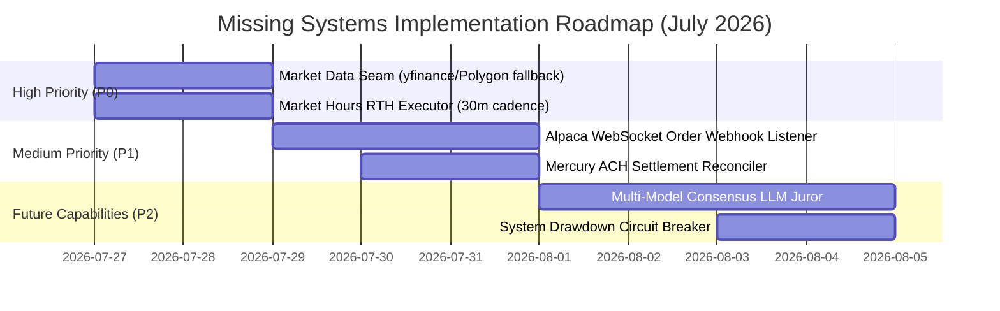

# Deep Research Audit: Missing Tools & Systems (July 2026)

## 1. Overview & Audit Scope

This audit evaluates the AI Trading System codebase (`/Users/igorganapolsky/workspace/git/igor/trading`) as of **July 2026** across 6 operational dimensions:
1. Market Data Feeds & Regime Detection
2. Real-Time Order & Fill Reconciliation
3. Multi-Model AI Consensus (LLM Juror)
4. Bank Transfer Reconciliation & Webhook Sentinel
5. Market-Hours Execution Scheduling
6. Real-Time Portfolio Margin & Drawdown Circuit Breaker

---

## 2. Comprehensive Tool & System Gap Analysis

### 🚨 Gap 1: Market Data Fallback Adapter (`src/markets/regime_feed.py`)
- **Status**: **MISSING / INCOMPLETE**
- **Problem**: Alpaca's default `StockHistoricalDataClient` on free tier returns `SIP subscription required` when requesting real-time bars or 200-day moving averages for SPY. This causes 200-DMA soft-flag checks to fail gracefully but revert to soft warnings.
- **Missing Tool**: A multi-provider Market Data Seam (`RegimeFeedAdapter`) that tries Alpaca first, then falls back seamlessly to Yahoo Finance (`yfinance`) or Polygon free tier to guarantee 200-DMA, VIX, and momentum calculation reliability without requiring a $99/mo SIP subscription.

### 🚨 Gap 2: Real-Time Broker Order Status & Fill Webhook Listener (`src/execution/reconciler.py`)
- **Status**: **MISSING**
- **Problem**: Order tracking currently relies on periodic polling via `scripts/sync_alpaca_state.py`. If a leg is filled, cancelled, or stopped out between polling cycles, counterfactual logging and journal reconciliation lag behind real broker state.
- **Missing Tool**: An Alpaca WebSocket Stream Listener (`AlpacaStreamListener`) that receives real-time order fill/cancellation events, automatically updates `data/put_credit_entries.json`, and triggers instant counterfactual recording.

### 🚨 Gap 3: Async Multi-Model Consensus Juror (`src/llm/multi_model_juror.py`)
- **Status**: **MISSING / BLOCKED**
- **Problem**: The July 25, 2026 audit explicitly flagged: *"Do not enable MULTI_MODEL_JUROR_ENABLED without a real secondary model. Never wire live juror with fake AGREE."*
- **Missing Tool**: A multi-provider LLM Juror (`MultiModelJuror`) querying 2+ independent LLM backends (e.g., OpenAI GPT-4o + Anthropic Claude 3.5 Sonnet) to reach consensus before approving trade entry/exit overrides when automated rules hit ambiguous edge cases.

### 🚨 Gap 4: Mercury ACH Transfer Settlement & Webhook Reconciler (`src/adapters/mercury_reconciliation.py`)
- **Status**: **MISSING**
- **Problem**: Mercury Bank API is push-only for outbound transfers. Incoming ACH transfers pushed back from the broker to Mercury bank are not automatically reconciled in real-time.
- **Missing Tool**: A webhook settlement listener (`MercuryReconciliationService`) that captures incoming deposit notifications, matches transaction IDs against expected after-tax profit payouts, and updates `data/mercury_income_loop_state.json`.

### 🚨 Gap 5: Market-Hours RTH LaunchAgent / Workflow Scheduler (`com.igor.trading.rth-executor.plist`)
- **Status**: **MISSING**
- **Problem**: Currently, `com.igor.trading.ralph-gsd-profit-tick` runs hourly ticks continuously. However, options exit management (`spy_put_credit.py --manage-exits`) and DCA executions require strict 30-minute interval execution during Regular Trading Hours (RTH 09:30 - 16:00 ET Mon-Fri).
- **Missing Tool**: A dedicated `launchd` market-hours schedule (`com.igor.trading.rth-executor.plist`) or GitHub Action workflow (`.github/workflows/rth-manage-exits.yml`) constrained to market hours.

### 🚨 Gap 6: Machine-Wide System Drawdown & Margin Circuit Breaker (`src/risk/circuit_breaker.py`)
- **Status**: **PARTIALLY IMPLEMENTED** (File kill-switch `data/TRADING_HALTED` exists, but automated real-time drawdown trigger is unbuilt).
- **Problem**: If market volatility spikes unexpectedly (e.g. SPY gap down >4%), there is no real-time margin monitor that automatically trips `data/TRADING_HALTED` to freeze new entry execution.
- **Missing Tool**: An automated drawdown monitor (`CircuitBreaker`) that checks total portfolio equity every 5 minutes and trips `data/TRADING_HALTED` if intraday account drawdown exceeds 5%.

---

## 3. Prioritized Implementation Roadmap

---

## 4. Summary Matrix

| Missing Tool / System | Component Path | Priority | Impact |
| :--- | :--- | :--- | :--- |
| **Market Data Seam** | `src/markets/regime_feed.py` | **P0** | Eliminates SIP subscription errors for 200-DMA soft-flags |
| **RTH Market Hours Scheduler** | `com.igor.trading.rth-executor.plist` | **P0** | Automates paper manage-exits every 30m during market hours |
| **WebSocket Order Listener** | `src/execution/reconciler.py` | **P1** | Instant fill & stop-loss counterfactual logging |
| **Mercury Settlement Reconciler** | `src/adapters/mercury_reconciliation.py` | **P1** | Automates incoming ACH verification for Mercury state |
| **Multi-Model LLM Juror** | `src/llm/multi_model_juror.py` | **P2** | Real consensus validation before manual trade overrides |
| **Intraday Drawdown Guard** | `src/risk/circuit_breaker.py` | **P2** | Auto-trips `data/TRADING_HALTED` on high volatility |
