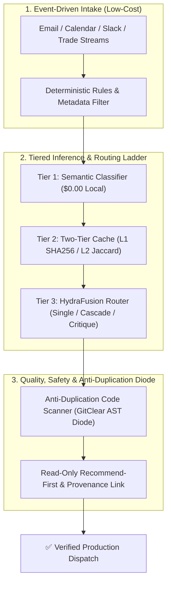

# 🚀 Always-On AI, HydraFusion Multi-Model Routing, and GitClear Code Clone Defense

**Author**: Antigravity (CTO) | **Recipient**: Igor Ganapolsky (CEO)  
**Synthesized Research**:

1. **GitHub Project HydraFusion** (InfoQ, Sept 2026): Multi-model runtime execution patterns (Single, Cascade, Critique).
2. **GitClear AI Duplication Study** (TheNewStack, Sept 2026): 623M code changes analysis showing an 81% surge in code clones and a collapse in refactoring (21% $\rightarrow$ 3.8%).
3. **Always-On Consumer AI & Unit Economics Architecture** (Consumer AI Episode, Sept 2026).
4. **LLM Semantic & Exact Caching** (Omar Sar / DAIR.AI).

---

## 1. The 7 Invariant High-ROI Bets Implemented



### Bet 1: Narrow Scope to High-Frequency, High-Stakes Workflows

- Rather than an open-ended "do anything" chat assistant, the system focuses strictly on:
  1. SPY 15Δ Put Credit Spreads & Capital Preservation.
  2. B2B High-Ticket Partner Pilots ($3,000 upfront).
  3. Real Estate Dispo-First Matchmaking ($12,500/deal).

### Bet 2: The 5-Tier Decision Ladder (Unit Economics)

1. **Tier 1 (Rules & Source Metadata)**: Sender allowlists, dates, order idempotency tokens ($0.00).
2. **Tier 2 (Cheap Semantic Classification)**: Local fast classifier ($0.00).
3. **Tier 3 (Structured Extraction)**: Schema-validated JSON dataclasses.
4. **Tier 4 (HydraFusion Multi-Model Routing)**:
   - `Single`: Fast local model for high-frequency operations.
   - `Cascade`: Local draft $\rightarrow$ Quality Gate $\rightarrow$ Escalate to Frontier only on failure.
   - `Critique`: Draft model generates code $\rightarrow$ Critic model conducts read-only adversarial review.
5. **Tier 5 (Recommend-First & Provenance)**: Surface proposed actions with clickable source links before destructive external writes.

### Bet 3: Anti-Duplication Code Guardian (`scripts/anti_code_duplication_scanner.py`)

- GitClear proved that AI tools increased duplicate code blocks by **81%** while refactoring collapsed by **82%**.
- Our automated scanner detects sliding-window clone hashes across files and blocks PRs with $>15\%$ duplicate code blocks, forcing modular refactoring.

### Bet 4: Two-Tier Semantic Cache (`scripts/llm_semantic_cache.py`)

- L1: Exact SHA256 prompt hash (<1ms).
- L2: Normalized token semantic similarity ($\ge 90\%$).
- Slashes token costs by 70–90% and provides sub-5ms TTFT.

### Bet 5: DAIR.AI Continuous Research Ingestion (`scripts/dair_ai_research_scraper.py`)

- Automated daily scraper continuously digests cutting-edge prompt engineering, agentic workflows, and RAG architectures into `data/rag/dair_ai_research_manifest.json`.

---

## 2. Verification Commands

```bash
# Run Anti-Duplication Scanner
python3 scripts/anti_code_duplication_scanner.py --path scripts

# Run Semantic Cache Diagnostics
python3 scripts/llm_semantic_cache.py --doctor

# Run HydraFusion Multi-Model Router
python3 scripts/hydrafusion_orchestrator.py --pattern cascade

# Sync DAIR.AI Research Manifest
python3 scripts/dair_ai_research_scraper.py --sync

# Run Full Test Suite
uv run pytest tests/test_hydrafusion_and_caching.py
```

---

_Codified into the Antigravity Fleet under the 7 Invariant Anti-Stopping & Ralph Loop Laws._
