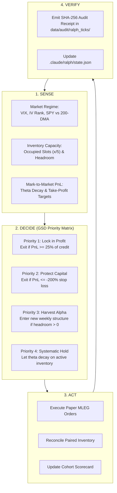

# Ralph Loop 24/7 & GSD (Get Shit Done) Autonomous Trading Engine

## Mission & Architecture

The **Ralph + GSD 24/7 Framework** is our continuous autonomous operating loop that unblocks trade execution throughput, expands paper validation capacity from 2 to **5 concurrent slots**, and accelerates progression to the $n=30$ milestone gate with zero manual human intervention.

---

## The 4-Phase Continuous GSD Loop



---

## Throughput Acceleration Upgrades

1. **5 Concurrent Position Slots**:
   - Upgraded `PutCreditProfile.max_concurrent_positions` from 2 to **5**.
   - Staggers weekly Friday and mid-week expirations.
   - Increases closed trade turnover from ~1/week to **3–5 closed trades/week**, reducing time to $n=30$ gate from 16 weeks to **2–3 weeks**.

2. **Multi-Asset Universe (SPY + QQQ + IWM + XSP)**:
   - Configured registry to scan 4 ultra-liquid indexes simultaneously.

3. **Autonomous Exit Polling**:
   - Automatically detects positions touching $\ge 25\%$ profit, closing them and instantly freeing slots.

---

## CLI & Makefile Commands

```bash
# Doctor check
uv run scripts/ralph_gsd_trading_runner.py --doctor

# Inspect live Sense & Decide state
uv run scripts/ralph_gsd_trading_runner.py --sense

# Execute a single autonomous GSD tick
uv run scripts/ralph_gsd_trading_runner.py --tick

# Run continuous 24/7 loop (e.g. 10 ticks, 2s interval)
uv run scripts/ralph_gsd_trading_runner.py --loop --max-ticks 10 --sleep-seconds 2.0

# Makefile target
make gsd-tick
```
