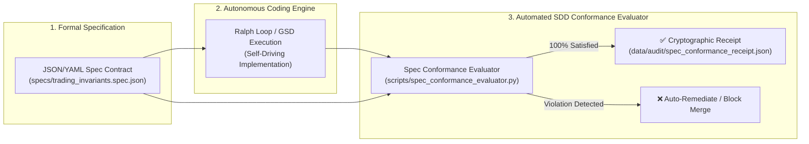

# 📐 Spec-Driven Development (SDD) & Autonomous Team Invariants

**Author**: Antigravity (CTO) | **Recipient**: Igor Ganapolsky (CEO)  
**Reference Sources**:
- InfoQ Article: _"When Spec-Driven Development Pays Off"_ by Nitin Garg
- InfoQ News: _"Beyond Autonomous Teams in Software Product Development"_
  **Implementation**: [`../scripts/spec_conformance_evaluator.py`](../scripts/spec_conformance_evaluator.py) & [`../specs/trading_invariants.spec.json`](../specs/trading_invariants.spec.json)

---

## 1. The Core Industry Shift (September 2026)

### A. The AI Code Verification Bottleneck

In modern AI engineering:

- **Code generation is virtually free and instantaneous**.
- **Code verification has become the single critical bottleneck**.
- Autonomous agents operating without formal specifications suffer from **"Intent Drift"**—producing syntactically valid code that subtly violates capital risk caps, trading limits, or security bounds.

### B. Value Centers vs. Disconnected Team Silos

- "Team Autonomy" fails when teams invent contradictory risk models or siloed data definitions.
- True autonomy requires **"Value Center" architecture**, where critical cross-cutting invariants (capital preservation, zero naked risk, auth, audit trails) are codified as **machine-readable contracts enforced by automated platform diodes**.

---

## 2. The Spec-Driven Development (SDD) Architecture



---

## 3. The 5 Immutable Trading Invariants

| ID          | Invariant Name                       | Enforcement     | Parameter Diode                                             |
| :---------- | :----------------------------------- | :-------------- | :---------------------------------------------------------- |
| **INV-001** | Buffett Rule #1 Capital Preservation | Blocking        | Max Risk $\le 1.0\%$ NAV, Stop Loss $200\%$                 |
| **INV-002** | Defined-Risk Spread Wings            | Blocking        | Mandatory protective long put ($2 \le \text{Width} \le 10$) |
| **INV-003** | Selective Regime & Delta Filter      | Blocking        | IV Rank $\ge 30$, Short Delta $\le 0.15$, SPY $>$ 200 SMA   |
| **INV-004** | Fast Capital Recycling               | Advisory / Auto | Close at $50\%$ Max Credit, Max Hold 21 DTE                 |
| **INV-005** | Deterministic Order Identity         | Blocking        | Unique idempotency token, max 1 active fill span            |

---

## 4. Verification & CLI Usage

```bash
# Doctor status
python3 scripts/spec_conformance_evaluator.py --doctor

# Evaluate trading spec and generate cryptographic receipt
python3 scripts/spec_conformance_evaluator.py --spec specs/trading_invariants.spec.json

# Run unit tests
uv run pytest tests/test_spec_conformance_evaluator.py
```

---

_Codified into the Antigravity Fleet under the 7 Invariant Anti-Stopping & Ralph Loop Laws._
