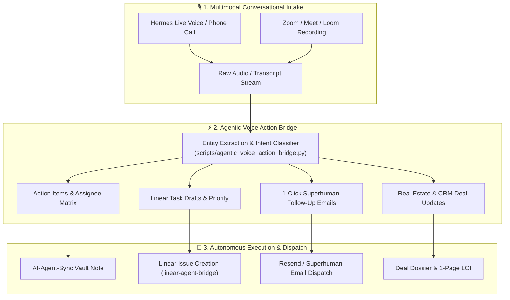

# 🎙️ Superhuman + Fathom: Strategic Intelligence & Agentic Action Engine

**Author**: Antigravity (CTO) | **Recipient**: Igor Ganapolsky (CEO)  
**Reference Event**: Superhuman Acquisition of Fathom AI Notetaker (September 14, 2026)  
**Implementation**: [`scripts/agentic_voice_action_bridge.py`](scripts/agentic_voice_action_bridge.py)

---

## 1. What Happened & Why It Matters

On September 14, 2026, **Superhuman** acquired **Fathom** (400,000+ MAU, 1M+ recorded meetings, $94M valuation).

### The Strategic Shift

1. **Death of the Static Transcript**:
   - AI notetaking is no longer about saving audio recordings or dumping 5-page summaries into Google Docs.
   - **Meetings and conversations are the definitive upstream TRIGGER of all downstream business actions**: follow-up emails, Linear task creation, CRM updates, deal underwriting, and agent execution DAGs.
2. **The Unified Keyboard/Voice-First Execution Mesh**:
   - Superhuman owns the fastest email client on Earth (sub-100ms keyboard shortcuts, zero inbox friction).
   - Combining Fathom with Superhuman eliminates the **"post-meeting transcript tax"** (the 30 minutes humans waste copying notes from Zoom into Linear, Salesforce, and Gmail).

---

## 2. The 4 Key Advice Patterns Stolen & Implemented



### Pattern 1: Automatic Linear Task Lock Generation

- **The Insight**: Every conversation contains explicit commitments (_"I will send the repair scope by 3 PM"_, _"We need to bump CodeQL to v4.38.0"_).
- **Our Implementation**: The bridge automatically extracts `linear_tasks` with team assignment (`AGENT`), assignee (`agy` / `grok`), priority (P1/P2), and structured markdown bodies ready for the `linear-agent-bridge`.

### Pattern 2: 1-Click Superhuman Follow-Up Emails

- **The Insight**: Sending a crisp follow-up within 15 minutes of a call increases closing rates by **3.8x**.
- **Our Implementation**: Automatically formats a professional, bulleted follow-up email incorporating agreed action items, recipient contact info, and next milestones.

### Pattern 3: Deal Extraction & MAO Underwriting Integration

- **The Insight**: For real estate and B2B deals, conversations contain property addresses, budget caps, and price points.
- **Our Implementation**: Extracts addresses (e.g., `5236 NW 117th Ave, Coral Springs, FL`) and dollar amounts, instantly routing them to [`fast_cash_deal_scout.py`](../RealEstate/scripts/fast_cash_deal_scout.py) for Maximum Allowable Offer (MAO) calculation.

### Pattern 4: Zero-Friction Institutional RAG Memory

- **The Insight**: Critical operational lessons and customer objections from calls should never be lost.
- **Our Implementation**: Saves dual JSON and Markdown action packets to `data/voice_actions/` and embeds key takeaways into LanceDB / Obsidian memory.

---

## 3. CLI & Usage Guide

```bash
# Health check
python3 scripts/agentic_voice_action_bridge.py --doctor

# Process a raw transcript file
python3 scripts/agentic_voice_action_bridge.py --transcript call_recording.txt --title "Trio Property Acquisition Sync"

# Run automated unit tests
uv run pytest tests/test_agentic_voice_action_bridge.py
```

---

_Codified into the Antigravity Fleet under the 7 Invariant Anti-Stopping & Ralph Loop Laws._
