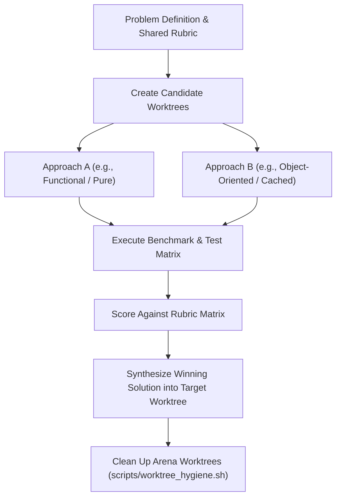

# pstack: /arena (Competitive Worktree Synthesis)

The `/arena` skill implements multi-candidate solution synthesis from the **pstack** engineering playbook. When designing a complex or critical module, rather than committing blindly to the first generated approach, `/arena` creates isolated competing candidate branches in dedicated git worktrees, benchmarks each against an identical rubric, and synthesizes the winning traits into the final branch.

---

## Operating Invariants

1. **Isolation in Worktrees**: Each candidate approach lives in its own dedicated git worktree under `.worktrees/arena-<candidate>/`. Never mix branches in the primary checkout.
2. **Identical Benchmark & Rubric**: Every candidate must be judged against the exact same test suite, performance benchmarks, and safety constraints.
3. **Deterministic Scoring**: Use quantitative metrics (execution time, test pass count, memory allocations, complexity, lines of diff) rather than subjective aesthetics.
4. **Synthesis Over Winner-Takes-All**: Often Candidate A has superior error ergonomics while Candidate B has superior performance. Synthesize the best parts into the target branch.

---

## Arena Execution Workflow



---

## Step-by-Step Procedure

### Step 1: Define Problem & Quantitative Rubric
Establish the rubric criteria:
- **Correctness (40%)**: Pass 100% of unit & edge-case tests.
- **Safety & Gate Compliance (30%)**: Adherence to `strategy_kill_switch.json` and zero corporate leak boundaries.
- **Latency / Performance (15%)**: Execution time for order evaluation.
- **Maintainability & Typing (15%)**: Clean type annotations, low cyclomatic complexity, readable docs.

### Step 2: Spin Up Candidate Worktrees
```bash
git worktree add -b arena/candidate-a .worktrees/arena-a origin/main
git worktree add -b arena/candidate-b .worktrees/arena-b origin/main
```

### Step 3: Implement & Benchmark Each
- In `arena-a`: Implement Approach A. Run `pytest tests/test_target.py` and benchmark.
- In `arena-b`: Implement Approach B. Run `pytest tests/test_target.py` and benchmark.

### Step 4: Score & Synthesize
Build the comparison matrix:
| Metric | Candidate A | Candidate B | Winner |
| :--- | :--- | :--- | :--- |
| Test Coverage | 12/12 passed | 12/12 passed | Tie |
| Execution Latency | 4.2 ms | 1.8 ms | Candidate B |
| Code Complexity | Low (clean functional) | Medium (state machine) | Candidate A |
| Boundary Resilience | High (strict dataclass) | Medium (typed dict) | Candidate A |

**Synthesis Plan**: Adopt Candidate A's strict dataclass contracts with Candidate B's optimized lookup algorithm.

### Step 5: Clean Up
Remove scratch worktrees safely via claim-aware hygiene:
```bash
scripts/worktree_hygiene.sh --remove .worktrees/arena-a
scripts/worktree_hygiene.sh --remove .worktrees/arena-b
```
