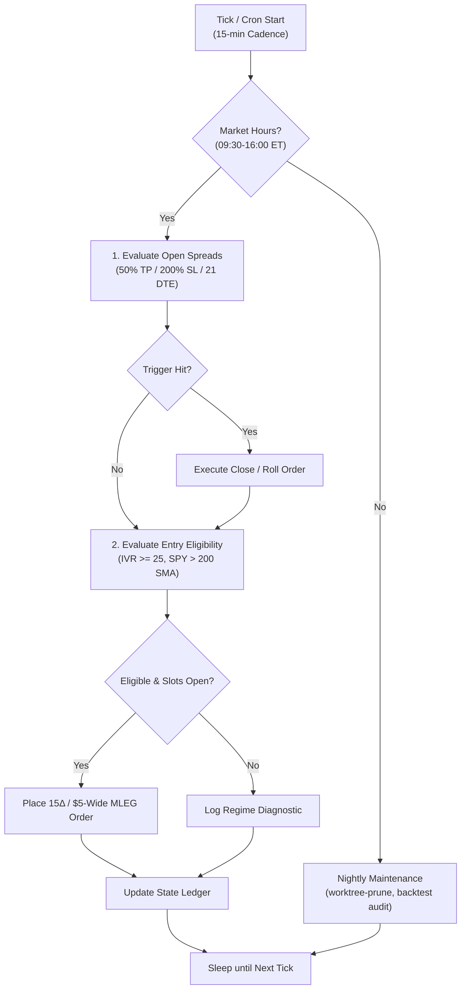

# Ralph Loop GSD Quant Engine (24/7 Autonomous)

## 1. Directive & Autonomous Philosophy

The **Ralph Loop GSD Quant Engine** operates on a zero-manual-labor mandate:

- **Sense**: Continuously poll market regime (SPY trend, VIX, IV Rank) and open option delta/debit marks.
- **Act**: Automatically take 50% profit, enforce 200% stop loss, execute 21 DTE exits, and enter high-IVR setups.
- **Self-Heal & Clean**: Automatically prune merged worktrees, reconcile account ledgers, and resolve CI conversation blocks.
- **Zero Babysitting**: Never create manual chores, copy-paste handoffs, or prompt blocking for the operator.

---

## 2. The 24/7 Continuous Execution DAG



---

## 3. Autonomous Runbooks & Recipes

### 1. Market Hours Position & Entry Evaluation

```bash
.venv/bin/python scripts/quant_core_engine.py --status
```

### 2. Autonomous Worktree Garbage Collection

```bash
# Safely inspect and prune all merged feature worktrees
scripts/worktree_hygiene.sh --prune-merged
```

### 3. Quantitative Parameter Tournament & Verification

```bash
.venv/bin/python scripts/historical_options_backtest.py --tournament
```

### 4. Unit Test Verification

```bash
.venv/bin/pytest tests/test_quant_core_engine.py
```
