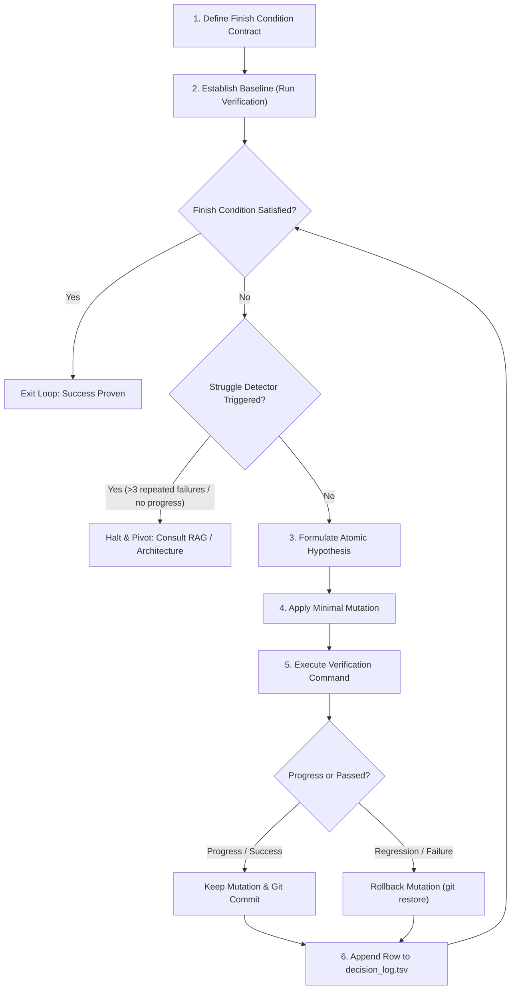

# Ralph Loop Skill

The **Ralph Loop** is an autonomous iterative execution framework designed to reliably drive software engineering tasks to completion without hallucinated success, endless circular modifications, or manual handoffs.

Derived from the autonomous agent engineering principles (and Lauren Tan's **pstack** methodology), Ralph Loop enforces that every single action is hypothesis-driven, atomically tested against real interfaces, immediately rolled back upon failure, and logged in a persistent decision trail.

---

## Core Principles

1. **Deterministic Finish Condition**: Never start work without a machine-verifiable exit criterion (e.g., test suite exit code 0, specific metric threshold, zero lint errors, dry-run passing).
2. **One Hypothesis, One Mutation**: Make exactly one justified change per iteration. Never bundle speculative refactoring with defect fixes.
3. **Prove It Works**: Test on the real execution interface (e.g., `make check`, `scripts/system_health_check.py`, `pytest`), not synthetic mock illusions.
4. **Immediate Revert on Regression**: If an iteration regresses or fails to advance toward the finish condition, revert changes immediately (`git restore`). Never build on top of broken state.
5. **TSV Decision Trail**: Every cycle logs a row to `data/audit/decision_log.tsv` capturing timestamp, iteration, hypothesis, action, evidence, and result.
6. **Circuit Breaker & Struggle Detector**: If 3 consecutive iterations produce the same error, or 3 iterations show zero progress, halt the loop and pivot strategy.
7. **Multi-Agent Coordination Integration**:
   - Check and respect active claims in the shared Obsidian Vault (`Handoffs/linear-claims/`).
   - Associate execution with a Linear issue key (`IGO-XXX` or `AGENT-XXX`).
   - Run in an isolated `git worktree`.
   - Log decisions to workflow notebooks for discoverability.

---

## Loop State Machine



---

## Step-by-Step Procedure

### Phase 1: Define the Contract
Before modifying any files:
1. Define the exact **Finish Condition Command**:
   ```bash
   # Example: Specific test suite
   pytest tests/test_skills_ralph_and_pstack.py -v
   # Example: Unified repository gate
   make check
   # Example: Health check
   SYSTEM_HEALTH_BOUNDED=1 python scripts/system_health_check.py
   ```
2. Verify isolation:
   - Run `make coordination-preflight` to ensure an active Vault claim and task worktree exist.
3. Run the baseline command and record the initial failure output.

### Phase 2: The Iterative Execution Loop
For iteration $k = 1, 2, \dots, N$:

1. **Check Exit Criterion**:
   Run the verification command. If exit code is 0 (or target metric met), exit to Phase 3.

2. **Check Struggle Detector**:
   - Compare current error signature with the last 2 iterations.
   - If identical error persisted 3 times: **STOP**. Do not retry the same fix. Re-read codebase via `pstack-how` or review prior lessons via `pstack-why`.

3. **Formulate Hypothesis & Modify**:
   - State: *"Hypothesis: Changing [X] in file [Y] will resolve error [Z] because [Rationale]."*
   - Apply only the minimal necessary edit.

4. **Verify**:
   - Execute the verification command directly.
   - Capture stderr, stdout, exit code.

5. **Evaluate & Gate**:
   - **Case A (Pass/Advance)**: Errors decreased or tests passed. Stage and commit:
     ```bash
     git commit -m "fix(ralph): iteration $k - <short description>"
     ```
   - **Case B (Fail/Regression)**: Revert immediately:
     ```bash
     git restore .
     git clean -fd
     ```

6. **Log Decision**:
   Append record to `data/audit/decision_log.tsv`:
   ```tsv
   timestamp	iteration	phase	hypothesis	action	evidence	result
   2026-09-23T16:20:00Z	1	MUTATE	Fix import path	Updated relative import	Exit 0, 5/5 tests pass	KEEP
   ```

### Phase 3: Verification & Evidence
When the Finish Condition is satisfied:
1. Run full project gate: `make check` and `make dry-run`.
2. Produce evidence report summarizing:
   - Total iterations executed.
   - Mutations kept vs reverted.
   - Final verification output and commit SHAs.
3. Update RAG lessons and Obsidian Vault claim note with results.
