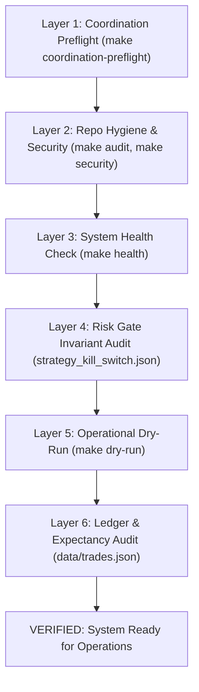

# Verify Trading Skill (Prove It Works)

The **verify-trading** skill embodies the core pstack principle **"Prove It Works"**: never accept "the build passed" or "the code compiles" as proof of readiness. This runbook exercises the actual runtime interfaces, broker simulators, ledger invariants, and risk gates of the Igor trading system.

---

## The 6-Layer Verification Hierarchy



---

## Verification Execution Playbook

### Layer 1: Coordination Preflight
Confirm that work is properly isolated and claimed:
```bash
make coordination-preflight
```
- Must return `errors: 0`.
- Verifies linked worktree, issue key branch name, and active Obsidian Vault claim.

### Layer 2: Hygiene & Security
Ensure zero code smell, linting regressions, or security vulnerabilities:
```bash
make lint
make audit
make security
```
- `ruff check` and `ruff format --check` must be clean.
- `audit_repository_hygiene.py` checks for zero corporate email leaks and clean file layout.
- `pip_audit` and `bandit` verify zero known vulnerabilities.

### Layer 3: System Health Check
Run the comprehensive bounded system health diagnostic:
```bash
SYSTEM_HEALTH_BOUNDED=1 python scripts/system_health_check.py
```
- Verifies database files, paper account connection, market data feeds, RAG indices, and disk bounds.
- Must output `✅ ALL CHECKS PASSED`.

### Layer 4: Risk Gate Invariant Check
Audit `data/runtime/strategy_kill_switch.json`:
- `live_blocked` MUST be `true` (live trading locked).
- `active_family` MUST be `"spy_put_credit"`.
- `iron_condor` entries MUST be killed/empty.

### Layer 5: Operational Dry-Run
Execute the active strategy in paper dry-run mode:
```bash
make dry-run
# Direct equivalent:
python scripts/spy_put_credit.py --dry-run
```
- Confirms options chain fetching, spread construction, strike selection, and delta calculation work end-to-end without submitting broker orders.

### Layer 6: Ledger & Expectancy Verification
Inspect paired closed trade ledgers:
```bash
python -c "
import json
trades = json.load(open('data/trades.json'))
print(f'Total closed paired trades: {len(trades)}')
"
```
- Confirm no unclosed or unmatched legs are counted as completed trades.
- Confirm edge criteria: Live trading remains blocked until $n \ge 30$ paired trades prove positive expectancy and profit factor $> 1.0$.
